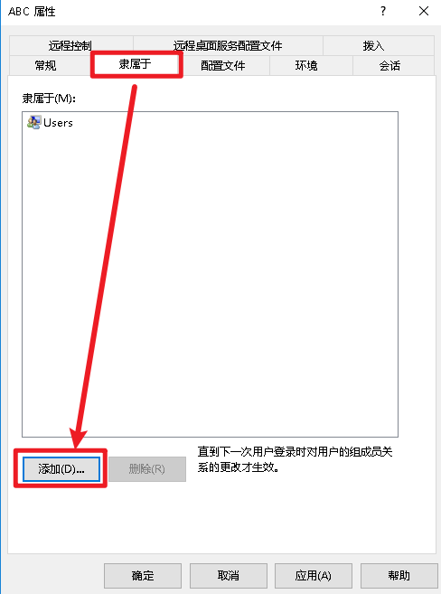

# 如何共用服务器？

### `请全程在服务器上设置，而不是在你自己的PC上`

## 创建用户

 这个教程主要是教你如何创建一个用户，并且把这个用户交给你的朋友用。

 首先，打开`计算机管理` 来进行我们的用户设置


 然后我们按照图中列表逐步点击，新建一个用户


到这一步还没有完！

 因为默认创建的账户是没有权限进行远程连接的，我们这里来进行一下允许远程操作

 首先 右键我们刚刚创建好的账户，然后点击【属性】


 然后点击【隶属于】，进行添加用户组



 打开界面之后，  
我们这里在下面的对象输入框中输入`Remote Desktop Users`  ，点击【检查名称】，最后点击确定

```text
Remote Desktop Users
```



如果你想给这个用户最高管理权限  
在这里顺便添加一次`Administrators`用户组即可

但是请注意,这个人可以对你的服务器做任何事,而且

### 酷Q 99.99%的情况_不需要_管理员权限来运行

如果你的朋友需要这个权限，可能是他想搭网站什么的，这时候就请你注意你的主机安全了。


 最后点击应用即可创建完毕账户


### 把服务器分享给朋友

  进行好设置之后，我们把我们的账号密码发给朋友


 同样的，朋友可以输入你的服务器IP、输入自己的用户名和密码进行登入


操作都相同，我就不说了，跟你的好基友玩的嗨皮！


