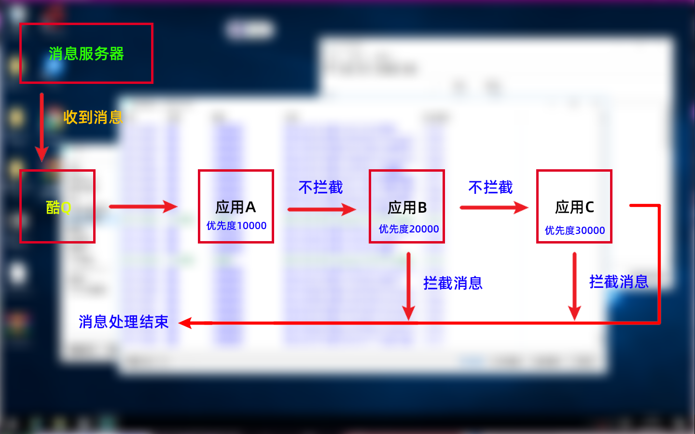

# 酷Q的消息处理逻辑

## 酷Q收到消息后，是如何给插件处理的？

 如果你是个酷Q日志爱好者（  
你可以经常在接收消息后看到如下“应用结束处理”

 这代表这个消息由酷Q交给插件处理的流程被 爱音乐 应用阻止其他插件处理

那么……  
为什么爱音乐应用会结束处理呢？  
为什么有些应用处理了消息不结束处理呢？  
……

 这里我们就涉及一个优先度的概念了。  
我们先来看一张图：

  由图得知，酷Q的消息处理是由一个个应用承接下去的  
其中应用优先度越小，越先处理消息


当优先度为10000（Or &lt;10000）时，应用将无法拦截消息。


 酷Q 规定应用处理优先度的规则：

* **`10000`** 最高 - 监控类应用，**无法用于拦截消息**。（如：消息数目统计等）
* **`20000`** 高 - 消息控制类应用，可用于拦截消息。（如：机器人开关等）
* **`30000`**一般 - 普通功能类应用。（如：天气查询、游戏类等）
* **`40000`**低 - 聊天对话类应用。（如：词库、云词库）

 那么问题来了，遇到同样优先级的应用B 和 应用C，哪个会优先被酷Q处理呢？

应用B:  应用C:  

假设：

> 应用B 的APPID为 com.exp.cc
>
> 应用C 的APPID 为 dom.exs.cc

则应用B 相对于 应用C 先处理消息

 因为载入顺序是按名称来载入的，然后再进行一次优先度分类。

 所以应用B 就能相对于应用C 更优先处理。

## 怎么修改优先度？

 应用处理的优先度是根据酷Q处理事件来进行分类的

 酷Q提供了以下可以修改优先度的事件

 我们选择事件-选择应用-优先级编辑框内进行编辑，最后点选保存并关闭即可


当然，如果一个应用没有提供私聊/群聊开关等禁用功能  
你也可以在这里进行对应事件的启用停用。


