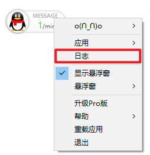
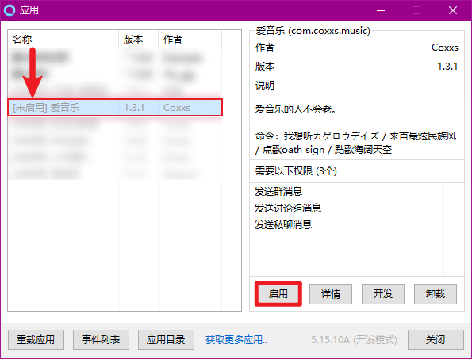

# 消息无法发送？操作无法执行？

## 前言

在使用插件的时候，我们经常通过发送信息给机器人的方式来让机器人执行某些指定操作  
例如跟机器人聊天，禁言他人，如下图所示

但是有时候我们的机器人突然就不回复了，~~这会让我们在一些场合装逼失败~~  
这就影响到我们机器人的正常使用了。

 本文会教你如何解决机器人无法回复。~~避免装逼失败~~

## 稍微了解原理

## 酷Q、插件问题

 首先我们需要打开酷Q日志来确认我们的问题在哪里。

 如果你没有启用酷Q，机器人是无法工作的。  
具体请看[【应用无法使用】](app-cant-use.md)

 然后往下继续看，确认问题即可。

### 消息未发送

 如果你发现插件没正常反应、发送消息，则插件根本没有对我们的消息进行回应

你可以检查以下情况来解决。

####  插件未启用

如果我们需要执行一个插件中的功能，则这个插件必须要启用才能使用这个功能。

 我们打开应用管理页面，以上面的点歌失败为例

 这里我们发现爱音乐应用没有被启用，只要我们启用后再尝试即可

####  插件未设置正确

 如果插件启用了，但是没有设置正确，也是不会发送信息的

 这里我们以天枢群管家为例，打开应用面板看一眼

  这里我们发现静默模式被打开了，群管家的静默模式会让我们的群管家无法发言  
这里关闭即可，其他插件同理，开了某些功能会导致无法发言  
或者你没有正确配置，使插件没有正常运作。


大部分插件都需要配置，不带傻瓜式操作。  
具体请查看相应插件文档，如无文档可以询问作者。


####  机器人屏蔽了群/指定联系人

### 消息发送失败

 如果你发现插件发送了消息，但是日志中提示参数错误  
请确认是否是以下两个问题，并解决再次尝试

#### 插件配置错误

这大部分可能是插件内的问题（例如机器人退群了，但是插件还往这个群发消息）

 这里还以天枢群管家为例，我们打开应用设置

 这里我们发现有一个群，这个群号是错误的，而且机器人根本不在这个群内  
我们根据插件的相应的错误解决配置错误的地方即可。

#### 机器人被禁言

 如果机器人所在群内被禁言，（不包含管理员+全体禁言情况）机器人大部分操作是无法执行的。

 请联系群内相应管理员解除机器人禁言。

###  消息已发送但是没收到

   如图所示，这里已经正常发送消息了，照理来说效果应该如下图所示。

 但是有时候，我们无法收到我们的消息

####  如何解决？

 发不出去有两个原因，一个是群号错了（酷Q有时候发言不会检查机器人是否在群内）  
这得看上面的[消息发送失](sendmsg-error.md#xiao-xi-fa-song-shi-bai) 来解决

另外一个是我们的消息被服务器当成垃圾信息被屏蔽了  
虽然发出去了，但是服务器没有将我们的消息给他人看。

 以下是我个人经验，你可以看一下。

#### 屏蔽问题为什么会发生？

* 异地登录、修改密码、手机号等异常操作导致
* 机器人发送消息过快
* 机器人刚注册就使用

#### 解决屏蔽问题：

* 将机器人所有插件关闭，不进行任何操作，不发送任何消息 等待几个小时到一周的不固定时间即可自动解除。
* 在挂机器人的地方使用机器人账户登录[这个页面](https://aq.qq.com)，有几率解除屏蔽问题

#### 预防屏蔽问题：

* 使用等级较高的机器人账号
* 将机器人多挂几周
* 避免异地登录、频繁上下线以机器人
* 开启设备锁
* 登陆时使用网页认证

