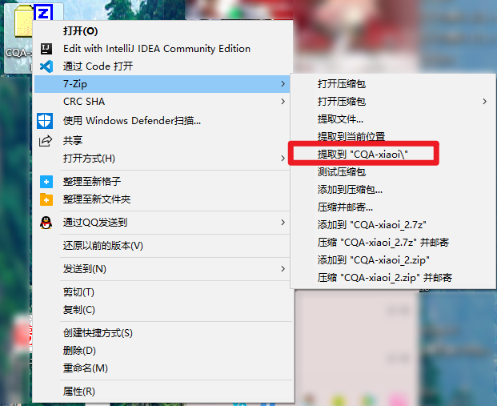

# 入门教程

### 欢迎来到精彩的酷Q机器人世界！


 酷Q是一款智能机器人软件，**严禁将酷Q用于广告、群发或其他违法、违规用途**。  
 [**应用使用规范（必读） »**](https://cqp.cc/t/38980)  
下载或使用软件即表示您已阅读并同意[服务条款](https://docs.cqp.im/about/tos/)及[隐私政策](https://docs.cqp.im/about/privacy/)。  
推荐系统版本：Windows 10 / Windows Server 2019


 _希望你对上面的声明有所耳闻。_

> _实际上，如果你的服务器配置较低，我们更推荐Windows 2012 R2_

 这篇文章会带领你了解什么是酷Q、如何使用酷Q。

##  首先，什么是酷Q？

酷Q是一个智能的机器人软件，但是智能可不是单单酷Q能实现的。

 酷Q只是提供一个框框，你可以把插件放到这个框框里面，用这个框框来进行一系列的机器人操作  
例如：生活信息查询、新闻、音乐分享等……  

 就好比手机需要应用才能使用一样


###  具体插件与酷Q的交互逻辑如下：


 如图所示，酷Q收到消息交给应用处理，如果应用想发消息就让酷Q去发给消息服务器

你可以模块化地加入不同作者制作的不同的应用，来实现不同的功能！  
这正是酷Q的强大之处，自定义一个属于你自己的AI机器人，与他人分享你的快乐！

你可以通过在酷Q论坛下载应用，来使酷Q变得丰富多彩。  
事不宜迟，我们赶紧学习如何使用酷Q罢！

##  开始使用

###  进入酷Q论坛

 首先，我们需要注册一个酷Q社区的账户  
账户可以用于插件发布、交流、记录捐赠，**但是您需要同意酷Q社区的相应条例**。


 注册完毕后，我们在左上角点击`酷Q Air`的帖子进行查看


这里我们以  为例，点击按钮后，我们的浏览器会自动下载酷QAir的压缩包  


### 解压文件 

下载完毕后，我们将压缩包里面的 酷QAir 文件夹 进行解压  
（这里我使用的是7-Zip）



### 运行酷Q

解压完毕后，我们打开 酷Q Air 的文件夹  
可以看到文件列表如下所示：


 第一次看到几个不知名的目录你可能不清楚他们的作用是什么  
我们暂且不管，双击CQA（CoolQ Air的缩写）来运行我们的酷Q  


### 酷Q初始化

初次运行酷Q可能需要初始化一下环境，如果无法访问、更新请看[这里](../q-and-a/cant-download.md)


 执行完更新后，会弹出一个服务许可框  
您需要清楚，酷Q air 是一个**免费**的机器人工具，**从未收费**


###  正式开始

#### 通过一系列`流 水 操 作`后，我们就可以看到酷Q Air的登录界面了



到这一步了，你需要注意一件事情  
机器人账号跟我们平常使用的账号无异，所以你可以使用任意一个账号登录  
但是请单独注册一个账号登录，避免他人以为你是机器人将你移出群，或引起不必要的麻烦。  
[注册账号步骤](morehelp/sign-up-qq.md)


###   登入账号

这里我们就可以登录机器人账号了。


如果您不是使用新注册账号，使用自用小号作为机器人  
请注意：可能会有异地登录检测，导致被BAN，属于正常现象，自行解除即可。



 登录完成后，右下角会出现机器人的悬浮窗，这一个大窗口就是我们的新手教程页面了。  
避免你有一些地方看不懂 ，我在这里演示一下，并解释一些你看不懂的地方。

###  三档起步 脱离小白

按照教程上说的，我们添加机器人的好友，并且发送“新手教程”。


 这里我就按照步骤来了，到具体的地方我会说明一下。


 这里要说下，小I平台已经整体升级，你可以在酷Q社区找到接入应用。


 海量应用 （指61页+不知道多少归档帖子）


###  尝试新应用

#### 看到这里，你是不是跃跃欲试，想要去尝试一些新的应用了？

不要急，好戏在后头。

> ### 到这里你可能遇到的一些问题：
>
> ①：[CPK（应用无法载入）](../q-and-a/cpk-cant-load.md)  
> ②：[酷Q的应用使用有没有先后顺序？](../q-and-a/priority/)  
> ③：什么是应用目录？  
> ④：为什么我的机器人按上述操作执行后没反应？  
> ……
>
> 如果你的进展比较快，可能就不止上面这些问题了。

 这时候我们重新打开酷Q air 的文件夹，你会发现多了一个名为data的文件夹


 这里你可能会对上面这些稀奇古怪的东西产生疑问了。  
我这里对文件目录进行一个讲解

###  文件目录

```markup
H:\DESKTOP\酷Q AIR //酷Q的目录
│  CQA.exe // 酷Q air的主程序
│  
├─app //存放应用的文件夹，我们一会将会在这里存放文件
│      com.coxxs.music.cpk  //这是一个应用，它的尾缀是.cpk
│      com.coxxs.start.cpk //也就是说这是个CPK文件
│      com.coxxs.status.cpk
│      com.xiaoi.robot.cpk
│      moe.min.qa.cpk
│      
├─bin  //这个文件夹存放了插件、酷Q所需的一些文件
│      CQMain.dll
│      CQP.dll
│      gzip.dll
│      htmlayout.dll
│      libeay32.dll
│      libiconv.dll
│      node.exe
│      sqlite3.dll
│      zlib1.dll
│      
├─conf //这里存放着我们的酷Q配置文件，包含我们的卡密文件
│      Account.cfg    //存放酷Q账号配置文件的地方
│      CQA.key        //酷Q授权认证的key
│      CQP.cfg        //酷Q Pro所需的配置文件，有时候通用air
│      
└─data //应用的配置数据
    ├─264593361     //这个是QQ号的文件夹，存放有关账号的信息
    │      cache.db     //存放一些关于群员名称、名片等信息
    │      eventv2.db   //存放一些事件，例如入群审核关键信息
    │      head.cache      //存放快速登录文件，以防频繁导致封号
    │      logv2_202006.db //日志文件，每个月都会生成一次
    │      session.dat 
    │      
    ├─app //应用数据目录
    │  └─com.coxxs.start //上面CPK的appid对应了这里的文件夹
    │          start.cfg //这就是一个应用数据，由应用作者定义
    │          
    ├─bface //存放大表情缓存文件的地方
    ├─image //存放酷Q图片的
    │      456917FAA3403CB6901ED45905B4CE08.jpg.cqimg
    │      718BDDFF87B5BD178086695F2DECBA55.jpg.cqimg
    │      // 如你所见，酷Q的图片缓存以.cqimg结尾
    │      // 如果你想知道怎么发图片，请看下面的链接
    │      
    ├─log //存放旧日志的地方（新酷Q为什么要创建）
    ├─record //存放酷Q语音文件的地方
    ├─show //存放酷Q SHOW 文件的地方
    └─tmp //缓存文件
```



### 开始下载应用

 了解完基础目录后，你应该很明白这些文件夹的用途了

 事不宜迟，我们尝试一下如何下载应用吧！

 


 到了这一步，你可能急于找插件  
一个插件文件在应用帖子中可能是这样的：

*  
*  
* 或者是一个网盘链接

 我们尝试下载群管家插件试试手


####  下载完毕后，我们进行解压


###  安装应用

得到应用文件后，我们将其放到酷Q 的app目录中，这一点上面已经说过了


```markup
……
├─app
│      cn.izoyo.manager.cpk
│      com.coxxs.music.cpk
│      com.coxxs.start.cpk
│      com.coxxs.status.cpk
│      com.xiaoi.robot.cpk
│      moe.min.qa.cpk
……
```

 放入插件后，我们这里在应用管理界面里面重载一下应用


 因为我们已经不用教程了，这里顺手将教程关一下



### 不使用的应用请及时关闭，避免造成酷Q处理消息缓慢


 这里我们载入后看到了我们的群管家应用  
同样，群管家是一个新应用，默认不会被启动  
这里我们尝试启用一下应用


 如图所示，弹出了三个提示框  
分别是：

* 语音功能提示（[酷Q Pro 安装语音组件后此提示会消失](morehelp/upgrade-to-cqp.md#shi-yong-kuqyu-yin-zu-jian)）
* 大量权限提示
* 敏感权限提示

 这里确认一下我们应用所需的权限


请确认应用获取的权限是应用所需的，如果应用获取了并不需要的权限  
请确认应用可信度后再启用

### 如果应用恶意使用用户账户进行违规操作，请在[这里](https://cqp.cc/b/support)进行举报


 再回去看上图，右下角确认权限后弹出了一个应用初始化的提示  
当然，你看到的提示也可能是这样的：  


 这里请看 [应用无法使用?](../q-and-a/app-cant-use.md) 然后向相应的插件作者所求帮助。

### 开始使用应用

 再次回到应用管理页面  
我们发现，与【爱音乐】不同的是，群管家是有一个菜单的。

我们点开这个菜单，点击【应用设置】  
当然，这个词是应用作者定义的  
一般包含【`配置、设置、管理、后台`】这些词就是应用的管理页面入口了


 点击后，我们发现的确弹出了一个配置窗口  
这时候,你就会发现弹出了一个窗口


 这里就是群管家的配置页面了  
因为插件都不同，我这里就不做详细讲解了。

具体你可以询问插件的作者

> 都让你下载了总不能让你不清楚怎么用吧  
> 指路：[https://help.tensuu.com/](https://help.tensuu.com/) ——群管家帮助页面

## 结束语

 到这里，我认为你已经对酷Q的基本操作有了一定的了解

如果你想学习更多有关酷Q的知识，请在左边的帮助列表里面搜寻相应的帮助  
或者在右上角进行搜索。

