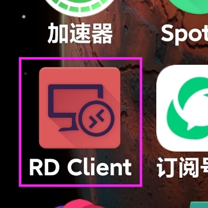
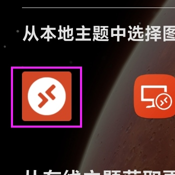

# 在服务器上运行酷Q

> [【悠扬】什么是云主机？](https://cqp.cc/t/29245)——给小白看的科普教程。
>
> [【Ym\_gg】如何完美的运用服务器/挂机宝?](https://d.tensuu.com/forum.php?mod=viewthread&tid=79&fromuid=22)——本帖的前身

##  准备工作

 首先想在服务器上面运行酷Q，理所当然的，我们需要有一个服务器

具体服务器购买我就不多说了，贴几个链接，你可以自己到下面的链接里面查看相关详情。

* 腾讯云：[https://cloud.tencent.com/](https://cloud.tencent.com/)
* 阿里云：[https://www.aliyun.com/](https://www.aliyun.com/)

另外推荐几款便宜值得买的服务器：

* [阿里云学生机](https://promotion.aliyun.com/ntms/act/campus2018.html?spm=5176.14145661.J_3598540520.ace-channel-latest-activity-card.607a1875YtHeWj&accounttraceid=4479725cda894f09a6b950fd89c06989jhof&userCode=d9rvjzs3&tag=share_component&share_source=copy_link)\(1H2G 1M-5M\) 9.5 ￥/月 如果需要强劲CPU性能，请选择”云服务器ECS“ 如果想顺手搭建个MC服务器，请选择”轻量应用服务器“，带宽更高。 但是轻量无法开通25端口，无法使用windows 2019镜像，无法备份……限制多 tip：阿里云学生机12-24岁的用户可以购买，最高续费到24岁
* [腾讯云学生机](https://cloud.tencent.com/act/campus)（1H2G1M）10 ￥/月 仅仅只可续费3次，所以说最高能用4年
* [腾讯云新用户优惠](%20https://cloud.tencent.com/act/cps/redirect?redirect=1025&cps_key=ec145f753e30cfee1b7e7becb154b0fb&from=console) 性价比基本上跟上面的一样 hmm,老用户表示很难受 新用户建议买2H4G5M 1年-3年的配置，老用户没有这些优惠 如果你作为新用户购买了1H2G，以后新用户优惠就没有了
* `偷偷告诉你：淘宝也能购买上面的服务器，而且价格 有折扣`


### 注意： 如果服务器介绍页面写了类似于：_**`性能基线20%`**_ 的字样，这证明这个服务器只能给你保证20%的CPU资源可用，所以说这就是个坑。


### 注意:不要购买”虚拟主机“

 你可能看到部分云厂商的”虚拟主机“十分便宜，价格吊打上面  
但是请注意：_你**压根**就不知道这个虚拟主机是干嘛的_

 简单的来说，虚拟主机只能**搭建网站**，而且压根不是拿可远程控制操作系统给你用  
_压根儿不能挂酷Q_


### 酷Q所需的最低服务器配置： 1GB 运行内存 1G _起始_所需储存  最低Windows 2012 r2 \(win8.1\)操作系统


 所以说，我们购买的服务器_**必须支持 Windows 操作系统**_`（别跟我说98 3.1什么的）`

## 开始连接服务器！

 首先 我们整一个服务器之后，需要获取我们服务器的连接IP

这里我们使用轻量应用服务器进行测试

 确认一下服务器信息：

### 获取公网IP

 我们可以从上面获取公网IP  
操作系统中的密码是你在购买、重置的时候决定的。

 公网IP的格式如下：`xxx.xxx.xxx.xxx`     
例如：127.0.0.1 、45.484.564.387等等  
然后要认准上面的公网IP，私网IP是用通用服务的


请妥善保管公网IP，避免服务器被 $$hyr $$ 爆破。


 获取IP后，就开始连接服务器了，上面我们获取了三个信息：公网IP、密码

> $$“账户呢？”$$

 别急，一般Windows server  的默认账户都是`Administrator`

  如果你想创建其他账户，在子章节”如何共用服务器“中有讲到。

### 在PC上连接服务器

#### 打开Mstsc

 打开mstsc很简单，有两种方式，如下：

> 加第二个的原因是因为有时候开始并不是那么好用

然后这里我们就打开了Mstsc的界面，输入刚刚获取到的公网IP，然后开始连接。

 然后点击确定，就可以看到我们的服务器页面了

### 在手机上连接服务器

> 这里用MIUI12 \(Android Q\) 进行演示，IOS的有中文我相信你应该看得懂

首先下载一下我们的”Rd Client“应用（又称 Microsoft Remote Desktop）  
苹果就叫微软远程桌面，它应该看起来是这个样子的： \(左旧右新\)  
  

####  为了方便你下载，我提供一下天翼网盘的链接（不限速，得登录）



 然后我这里直接放截图加说明，因为安卓是英文，所以顺手翻译一下\(  
我英文不好，欢迎你到gytpub上面发iuuse纠正我。

   

 这里跟电脑差不多，同样是在上面添加服务，不过安卓貌似更好玩一点。  
按下图设置，跟电脑大同小异，安卓提供多个账户添加。  
   

 

连接好以后就能用了。  
具体操作可以在[更高级的操作……](be-pro-on-server.md)中查看

## 上传酷Q

### 仅用WIn演示

 windows操作方便一点，安卓感觉不太现实  
或者你在服务器上面直接下载酷Q也可（记得[关闭IE安全配置](be-pro-on-server.md#guan-bi-ie-an-quan-pei-zhi)，或者用Chrome）

  然后打开服务器，直接将酷Q文件夹复制到桌面


你也可以尝试用QQ、FTP等方式进行传输。

远程桌面自带的如果遇到**垃圾网络**断流就会到结束的时候_上传失败_。


 上传完毕后，我们打开看看，跟本地的没有丁点儿区别。  
这时候我们直接双击酷Q 就可以运行了。

关闭远程连接窗口，回到群聊内尝试跟机器人聊天  
你会惊喜的发现~~（哇！光头）~~

 酷Q依然在保持正常的运行！


酷Q Pro迁移可能导致需要重新输入授权码



### 记得定期续费，不然你的服务器就完犊子了

### 密码保存好，不然你的服务器就完犊子了

### 插件设置好，不然你的服务器就被服务商噶了

### 服务器安全定期留意，不然你的服务器就`H`完`A`犊`C`子`K`了

### 服务器储存空间请留意，不然你的数据就完犊子了

### 注意你的朋友和你家狗和你家熊孩子，不然群友会嘎你牛子  



## 注意：服务器Administrator账号和老婆恕不外借!


